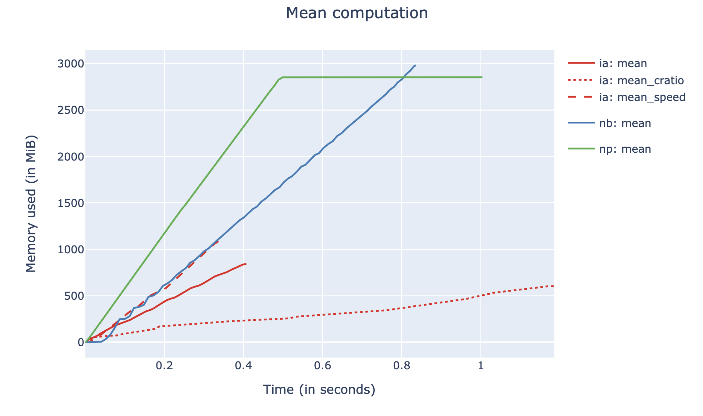

------------
Introduction
------------

ironArray for Python at glance
==============================

ironArray is a C library oriented to compute and handle large multidimensional arrays efficiently.
ironArray for Python is the official wrapper to it.

Among its main features you can find:

* Multidimensional and arbitrarily large arrays of floating point data (float32 and float64).

* Transparent, high-performance compression. The arrays are compressed and decompressed internally, without the need for user intervention. Use memory and disk resources more efficiently.

* Advanced compute engine, based on LLVM, for evaluating expressions with arrays as operands, reductions and a subset of linear algebra.

* Pervasive parallelism. All the operations are performed using an optimal amount of threads for the system.

* Native persistency. The arrays can be stored on disk and loaded very efficiently. Arrays can even be operated without the need to load them in-memory (aka out-of-core operation).

* Automatic fine-tuning based on underlying hardware. Important parameters of your CPU, like the number of cores or cache sizes, are automatically detected and used for optimal execution times.

* Python and C APIs. ironArray is a pure C library that comes with an easy to use Python wrapper. Use whatever you prefer.

* Easy to install. ironArray comes with Python wheels (which include the headers and binary libraries of the C library) for a fast deployment in all major platforms (Linux, Windows, Mac).

Basic operations
================

Array creation
--------------

Here it is how you create a persistent array::

    import iarray as ia

    ia.linspace(shape=(70, 130), start=-10, stop=10, urlpath="arange.iarray")

After that you will have a "arange.iarray" on-disk.  Later you can load it in-memory easily with::

    import iarray as ia

    myarr = ia.load("arange.iarray")

ironArray tries to mimic existing APIs in the PyData ecosystem, so chances are that most of standard
functions out there can work with ironArray too.

Array slicing
-------------

You can get and set whole areas of your array using the usual NumPy indexing notation::

    # Getting slices
    myarr = ia.load("arange.iarray")
    print("Second row:", myarr[1])
    print("Second column:", myarr[:, 1])

    # Setting slices
    import numpy as np
    myarr[0] = np.zeros(130)  # zero the first row
    myarr[1, 30:60] = np.ones(30)  # zero a part of the second row

Thanks to double partitioning, getting and setting slices are generally very fast operations.  However, getting or setting single (scalar) elements is generally slow, and not a good idea to use them intensively; it is better to group these changes on a NumPy array and then set the proper slice in one shot. You can get more information about array slicing and views in the `corresponding tutorial <https://ironarray.io/docs/html/tutorials/slicing.html>`_.

Expression evaluation
---------------------

One of the main features of ironArray is that it provides support for operating with compressed arrays efficiently and in a transparent way.  In the tutorials section you will see a lot of examples on how to deal with them, but here it is a simple example::

    x = ia.load("arange.iarray")
    y = ((x - 1.35) * (x - 4.45) * (x - 8.5)).eval()

So, ironArray understands simple expressions with arrays as operands.  Then these are evaluated by calling the `eval()` method.  That's pretty easy, and very fast too as you will see in the `tutorials <https://ironarray.io/docs/html/tutorials.html>`_.

Reductions
----------

ironArray implements a very fine-tuned algorithm for performing a variety of multidimensional reductions.  Here it is a small taste of how you can use this machinery::

    a = ia.arange([10, 20, 10, 14]) # creates an array of shape [10, 20, 10, 14]
    b = ia.mean(a)  # compute the mean of everything; results in an scalar
    c = ia.mean(a, axis=(1, 2, 3))  # compute the mean of all axes except 0
    d = ia.mean(a, axis=(2, 3, 1))  # compute the mean of all axes except 0; follow the order for performance

As can be seen, you can reduce as many dimensions as you wish, like in NumPy.  However, for chunked arrays like ironArray ones, you need to specify the optimal sequence of axes for performing the reduction efficiently.  See the `tutorial on reductions <https://ironarray.io/docs/html/tutorials/reductions.html>`_ for details.

Linear Algebra
--------------

Finally, you can perform linear algebra operations with ironArray too.  Here it is a small example::

    shape = [2000, 2000]
    a = ia.arange(shape)
    b = ia.arange(shape)
    c = ia.matmul(a, b)

There is a dedicated `tutorial for linear algebra and some examples <https://ironarray.io/docs/html/tutorials/linear-algebra.html>`_ of use too.

Configuration settings
----------------------

ironArray comes with an advanced configuration system that allows to configure your operations globally for a whole program, or locally for functions; you can even use contexts for using configurations that are valid in just regions of code::

    # Global configuration
    ia.set_config(codec=ia.Codec.ZSTD, clevel=1, btune=False)

    # Local configuration
    c = (x - y).eval(clevel=9, codec=ia.Codec.LZ4)

    # Context
    with ia.config(clevel=9, codec=ia.Codec.BLOSCLZ):
        c = (x - y).eval()

Use whatever version you prefer.  You can find more examples in the `Configuring ironArray tutorial <https://ironarray.io/docs/html/tutorials/configuration.html>`_.

Automatic tuning
----------------

ironArray comes with BTune, a sophisticated tuning tool to automatically choose the best codecs or filters that minimizes execution time, compression ratio or a balance among the two (the default).
Let's suppose that you are doing some computation in a Python script that you want to run as fast as possible; you can tell BTune to optimize things internally with::

    ia.set_config(favor=ia.Favor.SPEED)

Or, in case you may rather be interested in saving the maximum amount of memory (or disk)::

    ia.set_config(favor=ia.Favor.CRATIO)

Only with these small tweaks, you can make ironArray adapt to your needs very easily.  Look here at an example of BTune in action, and how it affects the speed of computation:

As you can see, favoring `SPEED` maximizes speed at the cost of using more memory.  On the other hand, favoring `CRATIO` maximizes compression ratio, and hence, minimizes memory consumption.  The default (`BALANCE`) is a balance among these two.
