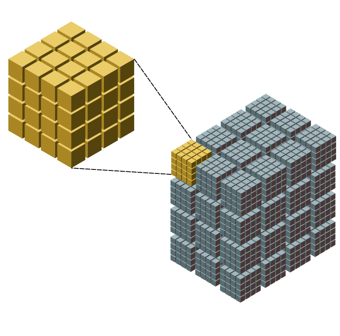
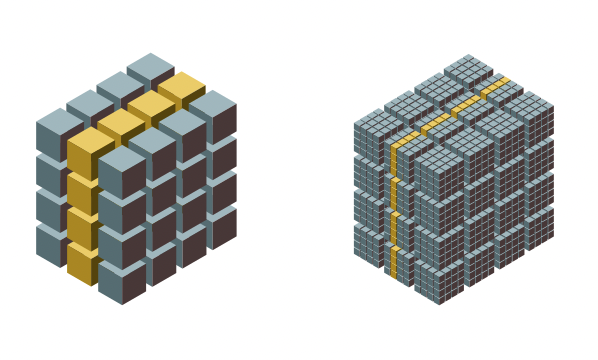

Two level chunking
==================

Why is it important?
--------------------

When implementing data containers supporting transparent compression, a common technique is to split the containers in so-called chunks.  This allows for avoiding to decompress the whole container for accessing just a subset of elements.  Here it is an example of such a chunked data container for an array of shape `(300, 400, 400)` and whose chunk shape is `(100, 100, 100)`:

Still, one of the drawbacks of chunking is that it stills requires to retrieve complete chunks even when we are requiring a thinner slice of data.  For example, if we require the plane of data where `dim0 == 140`, we should be reading (and decompressing) the next (rather big) yellow slice:

With a two level chunking, we are splitting the original chunk again, and we are getting another subdivision of chunks:

Now the chunks have been split in so-called blocks. In this case, the shape of these blocks is `(25, 25, 25)`, so that means that a single chunk is made by `4 * 4 * 4 = 64` blocks.

With that, let's see the amount of data that needs to be retrieved and decompressed (painted in yellow) for the plane `dim0 == 140`, with one level of chunking on the left vs two level of chunking on the right:

This is essentially why the two level chunking can lead to less reads and hence, better performance.

You can see some benchmarks on the double partitioning in the `slicing tutorial <https://ironarray.io/docs/html/tutorials/slicing.html#Performance>`_.
